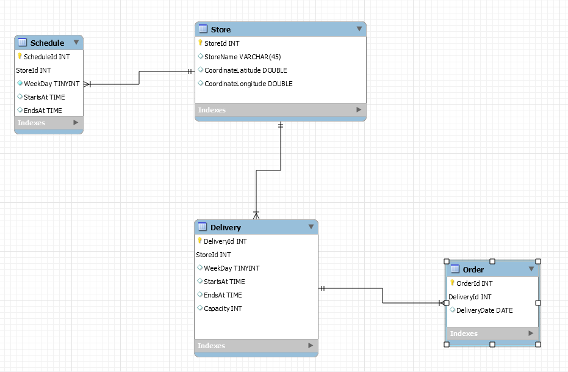

# InstaStore
Technical test for back-end by Dorian Abad Tovar Díaz.

## API

This API is developed on a Dockerized environment. It's deployed using two instances, one as a Node project that holds the business logic, the second one has a MySQL environment for data persistence purposes.

To run the project, you need to run this command (remember, you need to have Docker and docker-compose installed in your machine):


    docker-compose up

### Database

The database for this project is composed of the following tables:



Where:

* **Store:** Represents each individual store.

* **Schedule:** Holds the open and close schedules of the physical store.

* **Delivery:** Have the schedules for each delivery times in each store and the total capacity for each of those timelapses.

* **Order:** Each order is asigned to a delivery timelapse and represents 1 in the total capacity of delivery in each store.

### API Description

The API is comprised of an endpoint that looks like this:

* **Title**

    Get Closest Store

* **URL**

    /v1/store/closest/?latitude=X&longitude=X

* **Method:** `GET`

*  **URL Params**

   **Required:**
 
   `latitude=[double]`

   `longitude=[double]`

* **Success Response:**

  * **Code:** 200 <br />
    **Content:** 
    ```
    {
      "message": {
        "storeId": 5,
        "storeName": "Instastore Kennedy",
        "isOpen": 0,
        "coordinates": {
            "latitude": 4.609393346720635,
            "longitude": -74.15202185751941
        },
        "nextDeliveryTime": "2021-01-19T08:00:00.000Z"
      }
    }
    ```

    OR

    
  * **Code:** 204 <br />
    **Content:** ```No content```
    
* **Error Response:**
  * **Code:** 500 <br />
    **Content:** 
    ```
    {
      "message": 'Internal error'
    }
    ```

  * **Code:** 404 <br />
    **Content:** 
    ```
    {
      "message": 'URL not found'
    }
    ```

* **Sample Call:**
    * **Success Response with closest store (200):**
        
        http://localhost:3000/v1/store/closest/?latitude=4.616710202626701&longitude=-74.15306627892195
    
    * **Success Response without closest store (204):**
        
        http://localhost:3000/v1/store/closest/?latitude=4.610153044262533&longitude=-74.07053817093107

## Questions

1. About nextDeliveryTime, assuming a functionality from its name, I understand that specifies the time where is going to take place the next delivery of an order, so: 

/A: It's the next delivery schedule, I don't know if you've seen in apps like Rappi that when you order in the supermarket a list of hours comes out, sometimes there is a first schedule that is in the next hour but sometimes he only lets me order until the next day. The nextDeliveryTime refers to the nearest time interval in which I can order/deliver the order

  * Is this functionality periodically?, lets say, Is there an specified hour for each store for each day, weekly, monthly, bi-monthly, semestral?

/A: The stores have established daily schedules, so we add 8 am to 9 pm Monday to Saturday and Sunday from 9 am to 8 pm

  * The operation is specified by capacity?, that is to say, they have it established according to the capacity of each store independently to an established schedule?

/A: Yes, the ideal is to take into account the capacity of the store along with the schedule.

2. About the proximity of the stores, I understand that the endpoint returns the closest available store, then:
    
    * Is there any range of proximity?, that is to say, that it is possible to establish a radius in which the closest available stores can be established?

/A: More than the proximity range you can take into account the following parameters. In the endpoint you would receive latitude and longitude of the address they are asking. The furthest the customer's address can be is 5km from the store.

## Improvements and trade offs
1. What would you improve from your code? why?

    Maybe the nextDeliveryTime could be implemented in a more efficient way than checking by day.

2. Which trade offs would you make to accomplish this on time? What'd you do next time to deliver more and sacrifice less?

    I could choose to trade-off some of the environment preparations as Docker instances and environment variables instantiation for a better and deeper understanding of the nextDeliveryTime requirement.

3. Do you think your service is secure? why?

    Not completely, if the endpoint have the requirement of being consumed only by registered users, I could implement a JWT token verification subsystem to ensure the proper connection. I could add some security checks at Docker level and at a Node.js level.

4. What would you do to measure the behaviour of your product on a production environment?

    I would like to add different levels of testing to a product as it's known on the testing pyramid, from Unit testing, Integration testing, Functional testing up to Load/Stress testing and UI/UX testing.

