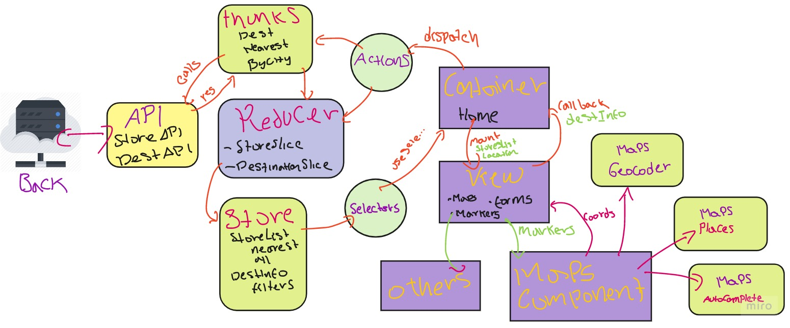
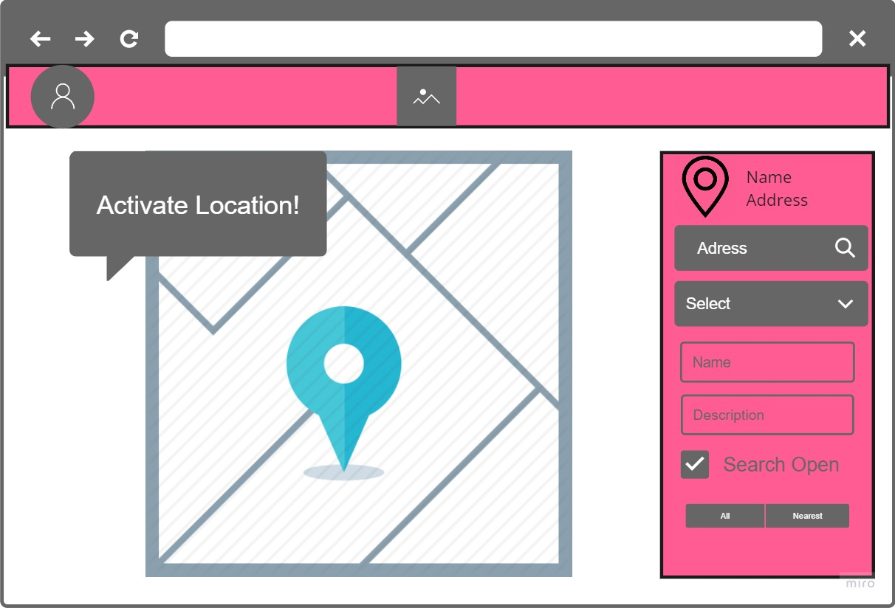
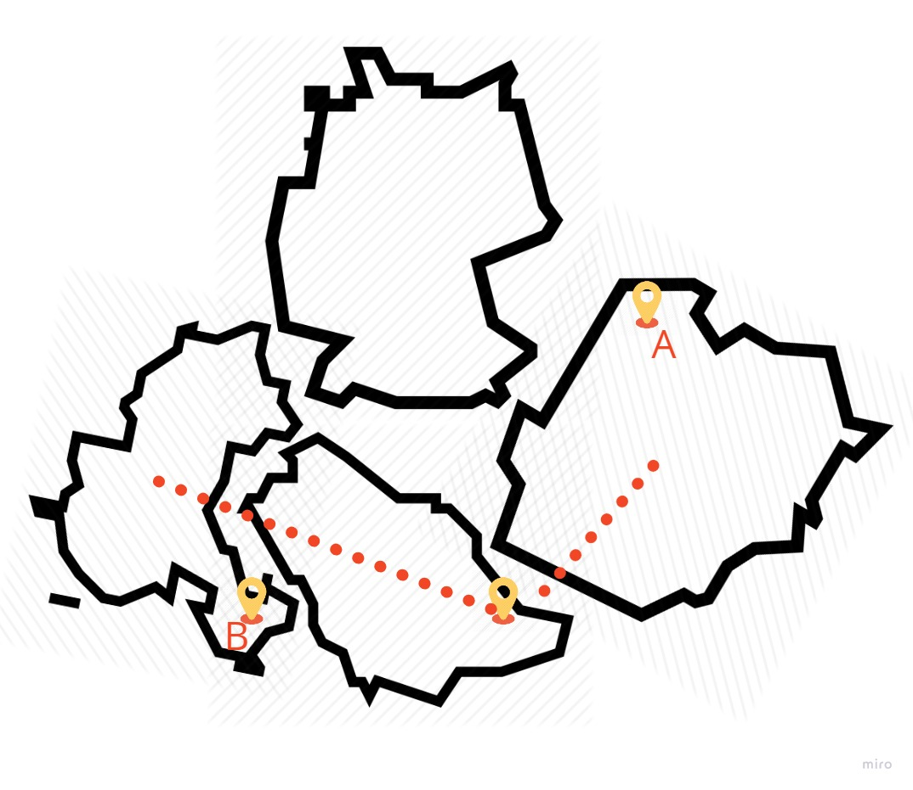

## How To run
## **Backend** 
Run this command in postgresql
#### - CREATE TABLE instastore;
Make sure you add and env with all the following keys, making changes where applied
```
#Maps
MAPS_API_KEY=****
#DB
DB_DEV_HOST=0.0.0.0
DB_DATABASE=instastore
DB_USER=postgres
DB_PASS=postgres
PGSSLMODE=no-verify
```
Then Run
```
#Maps
npm install
npm start
```
## **Frontend** 
front Git hub repo http://cdcordobaa.github.io/instastore-front-c


Make sure you add and env with all the following keys, making changes where applied
```
#API connection 
REACT_APP_API_URL=http:****
REACT_APP_API_STORES_URI=/stores
REACT_APP_API_DESTINATION_URI=/destination
#Maps
REACT_APP_MAP_KEY=****
```
Then Run
```
#Maps
npm install
npm start
```


## Requirements
InstaStore is a microservice in charge of selecting the closest "convenience" store to deliver a groceries order to our B2B clients.

### Non-functional
- We expect you to deliver idiomatic code in a way that is easy to read and follows the accepted guidelines in your area of expertise.
- You should write it on Node.js with Express.js. Libraries, transpilers , etc are up to you.
- Endpoints are fast (less than 300ms).
- Endpoints respond error codes that makes sense to the case.
- Please provide documentation for the endpoints you create.

### Functional (user stories)
1. Our B2B clients should be able to consume an endpoint that provides them the following information:
  - storeId
  - storeName
  - isOpen
  - coordinates
  - nextDeliveryTime
2. The endpoint returns the closest store available
3. We need to keep track of each call to the endpoint

## Q & A

### Questions
1. Q1: Do I need to return only the closest store based on the plain distance between two points? even if it is not open, or should I check its availability before returning it?

2. Q2: Should I limit the scope of the search?, (i.e. no stores in this city), should I return nothing or still returning the closes one even if it is in another city.

3. Q3: Can I as a user, search for a store which sells a particular item

4. Q4: What happens if I got two stores, the first closer that the second one, but with a NextDeliveryTime twice as long than the second.

5. Q5: should I seed all the store's address/positions, or should I extract that info from anywhere else.

6. Q6: I would like a bit of detail for the user journey with the app, should he log in first? should he need to enter additional info besides only getting their location, should the closest store be displayed as soon as he steps into the screen? - I'll make the decisions if no particular requirement is needed

### Answers

1. A1: You would need to check the availability. Propose the best way to manage the scenario in which the user is close to an store but the store is not open.
   
2. A2: It would be better if you limit the search area. Take into account that in many places in the world cities are very close and a store could be in the middle of them.

3. A3: No, I think that feature is out of scope for this test.

4. A4: You won’t need to use the nextDeliveryTime as a constraint for this.

5. A5: I attached a seed for this purpose

6. A6: I want you to be creative with this , keep it simple and optimise the goal “show me the closes store”. Users doesn’t need to be logged in.

## Endpoint
Content Dara for 
POST {url}/nearest


  ```json
  {
    "destination": {
        "address_two": "The Batcave",
        "description": "Bark loudly",
        "zip_code": "11020",
        "name": "Recoger en tienda Contry",
        "latitude": 25.7261055,
        "longitude": -100.1750157,
        "address": "Av. Eugenio Garza Sada 4321",
        "city": "Monterrey",
        "state": "Nuevo Leon",
        "country": "Mexico"
    }
}
  ```
  url}/nearest response


  ```json
  {
    "results": [
        {
            "id": "fe9a6c45-c5cc-48c6-b598-2a120830bac9",
            "name": "Recoger en tienda Contry",
            "is_open": true,
            "latitude": 25.726,
            "longitude": -100.175,
            "address": "Av. Eugenio Garza Sada 4321",
            "city": "Monterrey",
            "state": "Nuevo Leon",
            "country": "Mexico",
            "created_at": "2020-06-04T00:58:09.000Z",
            "updated_at": "2020-06-04T00:58:09.000Z",
            "distance": 0.007354642790629033
        }
    ],
    "info": "none",
    "error": null
}
}
  ```


##  The architecture of the service 

I implemented the Whole solution of the service using the following tech stack:
- Back: Express JS, Typescript, TypeORM for the database management, SwaggerUI for the documentation, and Winstone for the Logging and the Node.js Client for Google Maps to retrieve geographic information based on an address or a city name.
- Front: React, Typescript, Redux for store management, Thunk for asynchronous handling, Axios for API communication, Google map react as an interface to access all the services and efficiently rendering content inside the maps container, and Styled Components for styling.

This is the architecture of the backend services 


This is the architecture of the frontend client 




This is the initial mockup of the solution, it turned out pretty diferent




### Dev Process and Phases
The client and the service implementation took place separately and not in parallel, one after the other.  The client development and testing of the features were not blocked by the inexistence of the service using (https://www.mocky.io/) to fake the response as if a real server returned it. 
The implementation of the client itself had three steps process; The first one: creating the project boilerplate, all the styling, page layout and templating, components creation, and so forth. The second one; all the experimentation with the react-maps library, where many problems became delaying; such issues are in the main blockers section. The third one: all the connection with the redux and store and all the API calls.
 
The backend took place after the front and has been tested mainly with Postman client, implementing the controllers first with the data retrieval, then documenting the APIs and adding the Logger.

After the completion of two pashes, the service integration and the client didn't battle with many issues.


### Solution Approach
I proposed to development of the following features; nevertheless, not all of them are in a finished state by now. 

- Automatic geolocalization of the user: if available and the user grants permission to access their location, the application will center the map at the estimated position, with a marker showing that location.
  - State Front: Completed
  - State Back: N/A

- Search Autocompletion: the user will be prompt with autocompletion recommendations based on the estimated location while he is typing their address.
  - StateFront: Completed
  - State Back: N/A 
  
- Fiding the address by moving the marker over the map: The map can calculate the exact address by moving the marker over the map.
  - StateFront: Completed
  - State Back: N/A 
  
- Destination Form autocompletion: by moving the marker or writing the address, all the mandatory fields will be filled with the right information.
  - StateFront: Completed
  - State Back: N/A
  
- Search city stores: render the markers representing the position of all the stores in the city, with a radius of 30 kilometers around the user position.
  - StateFront: Completed
  - State Back: Completed
  
- Search Nearest Store(Distance): render a marker showing the closest store among the list of stores.
  
  If the city doesn't have any store or the distance between the user and the closest one is above a certain threshold, the service will perform a search on the two nearest cities. The service look for these cities using the next administrative level, i.e., if no stores are found in Monterrey, NuevoLeon, search for all the cities in the database which belong to NuevoLeon.
  The controller passes the names of these cities to the Node Maps service, which returns the {lat, lng} coordinates of each city. 
  And we calculate the haversine distance between the user position and the city coordinates. After that, we can figure out which are the two closest cities, where we will repeat the search for stores.

  This approach, however, has some caveats. First, harvesting distance is just a straight line between two geographic points and not driving range. Second, distance is calculated between the user and a city; a city coordinate often lies in its center. A user living on the edge of a city will not always find the real nearest. Third, since i am using just one table to represent a store, some performance is wasted retrieving all the stores belonging to all the other cities, this can be easily solved by having an entity city and another entity store. 

  


This image show the problem with the approach; the user will see the store B instead of store A.

  there is also an API which returns the nearest cities of a place, but I found pretty limited: (http://geodb-cities-api.wirefreethought.com/docs/api/find-near-city#/)
  
  - StateFront: Completed
  - State Back: Completed

- Search Nearest Store(Time): Render a marker representing the store with the soonest travel time to the user.
  I was trying to use Google Maps DistanceMatrix to get the driving distance, in driving length or in time, between two points.
  - StateFront: Completed
  - State Back: NOT Completed

- Search Nearest OPEN store:  The user can filter the search for only stores that are available at the moment.
   - StateFront: PARTIALLY Completed
   - State Back: NOT Completed

- Search nearest store who seels items of a particular category:  the user will select from a list of consumer categories the type of store he is looking for, and the near who seels such items, will be rendered in the map.
  - StateFront: NOT Completed
  - State Back: NOT Completed

- Display information of the store when clicking some marker:  the user will click on a marker and be able to view the details of the store.
  - StateFront: NOT Completed
  - State Back: Completed


## Main Blockers 

- **Google Map React:** This is a library challenging to use, with not so much flexibility neither modularization capabilities. It is poorly typed, and has a sort of outdated documentation. I did not change course in time and regretted it. I have as a lesson learned to use this one, I will use google-maps-react instead, which I did not choose this time for having less number of downloads than google-map-react.

- **TypeORM:**  It was my first time using typeORM following a recommendation, is reasonably simple and easy to learn, and it is typed!
  Yet, I lost a bit of time dealing with the migrations and my database.

- **Deployment:**
- Google
  I spent and an incredible amount of time trying to deploy the express service in Google app Engine and trying to get it connected to Google Cloud SQL. after 6 hours, or so I moved on.
- Heroku
  Heroku also gave me incredible amounts or problems with the connection to the database, firth with many issues related to SSL and security problems, and then running the migrations to setup de database.

- Constant refactoring: I spent considerable time moving code around to make it organized and structured.


## Improvements and trade-offs

### 1. What would you improve from your code? Why?
**Adding Unit Testing:** There is no way someone could move this to development without enough unit testing that guarantees that no other developer or me in just a few days, will mess everything up.
Calculate distance: I would change the way I'm calculating the distances to make it more accurate.

**Database Queries:** I would change the way I do the queries from the database and trying to do it more efficiently. I would even use some structures in memory to cache some commonly asked data.
Middlewares and Error handling: I'm not doing enough to catch all the errors and returning them in an appropriate way to the client.

**Logger:** Move Logger out of the index file.
In the front, I would move a lot of logic present in the main view file, to helpers functions in some shared folder.
I would add OAuth, and extensive request params validation on the endpoints.

### 2. What'd you do next time to deliver more and sacrifice less?
I believe that learning should always be part of the process, given the constraints though I should have limited the number of new libraries and/or technologies to experiment with.  

Trying to plan the modules and the way they will interact, even tough I implement the solution using a phase after phase approach, sometimes i found spend some time wandering around on different parts of the application trying to figure out the better way to connect them all and keeping it clean.
I would stick even more with the best practices like unit testing along the way, or even before implementing, and not waiting until too many logic have been written, making it even easier to keep procrastinating on this task

### 3. Do you think your service is secure? why?
No, it does not have any security at all, cors is configured with the wildcard "*" making it exposed to everyone. It does not have input validation, making it. Prone to injections, it does not have OAuth. It does not have SSL- or TLS. The application is running en development mode. Even database credentials and port ar the default ones. So this would no be a candidate at all for production.


### 4. What would you do to measure the behavior of your product in a production environment?
I would use some tools that provide live errors report, user session monitoring, latency information between function calls, and some performance statistics to detect bottlenecks. There are a handful of monitors for server-side applications: Appmetrics, Raygun, PM2 etc.


## Completion Time
### Development:  June 04, at 24:00 H
### Deployment:  June 05, at 22:00 H
### Doc and Delivery:  June 05, at 08:00 H
